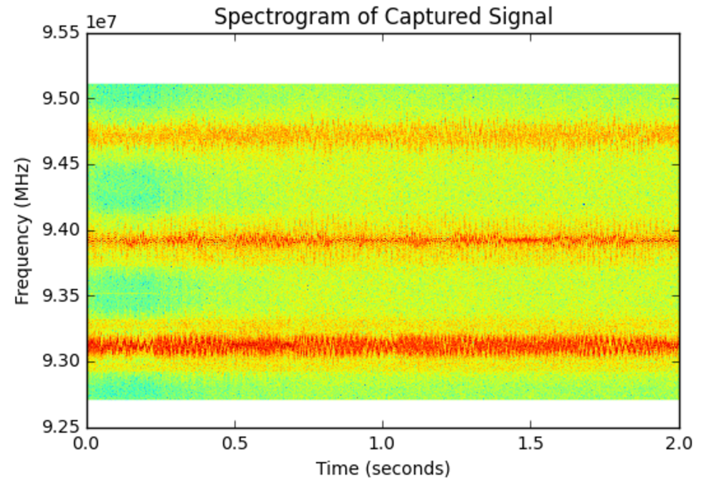
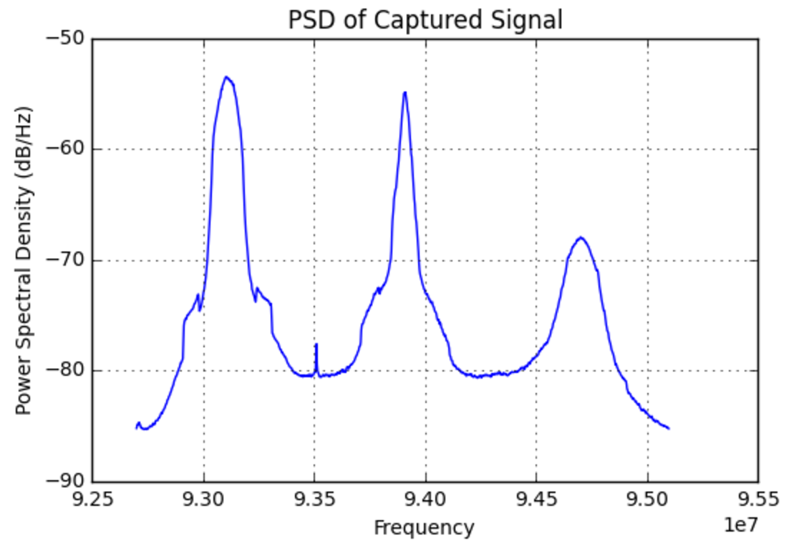

# Capture Raw IQ

## Links
- [This Notebook](https://github.com/nejohnson2/misc-notebooks/blob/master/rtlsdr.ipynb) uses the ```RTLSDR``` library to collect IQ samples for a specific amount of time.  It also implements an ```FM demodulator```.  This code is taken from ```[Software Defined Radio and the RTL-SDR dongle](http://www.eas.uccs.edu/~mwickert/ece4670/lecture_notes/Lab6.pdf)```
- [Advanced Topics in Wireless Communication](http://witestlab.poly.edu/~ffund/el9043/): This is the NYU Poly class that has lots of resources.
- [This Notebook](http://localhost:8888/notebooks/SDR_Lab_1.ipynb) are notes about FM demodulation

## Capture IQ

The snippet of code below is used to capture IQ samples for ```T``` seconds:

```python
def capture(Tc, fc=88.7e6, fs=2.4e6, gain='auto', ppm=60):
    '''Capture T seconds of I/Q samples'''
    # Setup RTLSDR
    # Tc is the time in seconds
    sdr = rtlsdr.RtlSdr()       # create the object
    sdr.sample_rate = fs        # Hz
    sdr.center_freq = fc        # Hz
    sdr.freq_correction = ppm   # 60 PPM
    sdr.gain = gain             # or auto
    Nc = np.ceil(Tc*fs)
    
    x = sdr.read_samples(Nc)
    sdr.close()
    return x
```
From here, one can demodulate the IQ as desired.

Another interesting approach is like this:

```python
import numpy as np
from rtlsdr import RtlSdr
import time, threading

NFFT = 1024 #*4
NUM_SAMPLES_PER_SCAN = NFFT*16

class Radio(object):

    def __init__(self, sdr):
        self.sdr = sdr

    def updateSamples(self):
        self.samples = self.sdr.read_samples(NUM_SAMPLES_PER_SCAN)
        self.psd_scan, self.f = psd(self.samples, NFFT=NFFT)
        threading.Timer(0.02, self.updateSamples).start()

if __name__ == "__main__":
    sdr = RtlSdr()
    radio = Radio(sdr)

    # some defaults
    sdr.rs = 2.0e6
    sdr.fc = 145.0e6
    sdr.gain = 10

    # start polling for samples
    radio.updateSamples()
```

which I found [here](https://github.com/irl/websdr-plus/blob/5a7b18889e5ebb6e40d3efcc880252e711b5be0b/app.py).  I dont like how it's plotted but the capture part is interesting.

### Multiple Devices
You can also specify which RTLSDR device you would like to use if you are using more than one.  Simple pass an integer into the ```RtlSdr()``` class which looks something like this ```sdr = rtlsdr.Rtlsdr(1)```.

### Plotting
There are then two wasy of plotting IQ data.  First you can use a spectrogram plot via matplot lib with ```plt.specgram``` or you can use a power spectrual desnisty plot with ```plt.psd```.  Here are two examples.

First with the spectrogram:

```python
# Pxx is the segments x freqs array of instantaneous power, freqs is
# the frequency vector, bins are the centers of the time bins in which
# the power is computed, and im is the matplotlib.image.AxesImage
# instance

Pxx, freqs, bins, im = plt.specgram(x, NFFT=1024, Fs=fs, Fc=fc)
plt.xlabel("Time (seconds)")
plt.ylabel("Frequency (MHz)")
```
which looks like this:



and then the PSD

```python
plt.psd(x, NFFT=1024, Fc=fc, Fs=fs)
plt.title('PSD of Captured Signal')
```

which looks like this



### Analysis with Scipy
Using scipy.signal Library with RTLSDR
