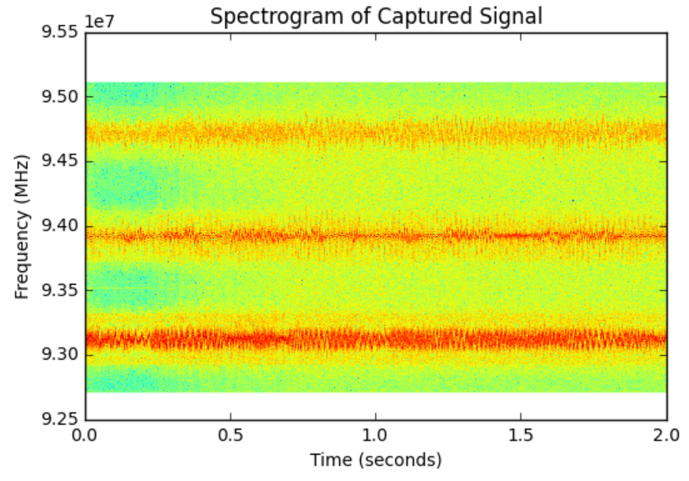
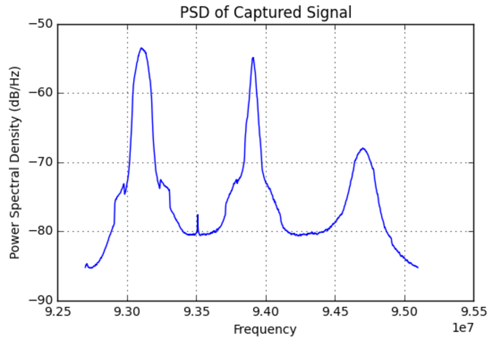

# Connecting Multiple SDRs

## RTLSDR

A couple of notes on using python to directly capture IQ samples from the Rtlsdr using the ```rtlsdr``` library.  First, you can specify the device index like this ```sdr = rtlsdr.Rtlsdr(1)```.    Below is an example capture function:

```python
def capture(id, Tc=1, fc=88.7e6, fs=2.4e6, gain='auto', ppm=60):
    '''Capture Tc seconds of I/Q samples
    Params
    ======
    index: int
        select the usb device if more than one is present
    Tc: int
        capture time in seconds
    '''
    # Setup RTLSDR
    sdr = rtlsdr.RtlSdr(id)     # create the object
    sdr.sample_rate = fs        # Hz
    sdr.center_freq = fc        # Hz
    sdr.freq_correction = ppm   # 60 PPM
    sdr.gain = gain             # or auto
    Nc = np.ceil(Tc*fs)
    
    x = sdr.read_samples(Nc)
    sdr.close()
    return x
```
There are then two wasy of plotting IQ data.  First you can use a spectrogram plot via matplot lib with ```plt.specgram``` or you can use a power spectrual desnisty plot with ```plt.psd```.  Here are two examples.

First with the spectrogram:

```python
# Pxx is the segments x freqs array of instantaneous power, freqs is
# the frequency vector, bins are the centers of the time bins in which
# the power is computed, and im is the matplotlib.image.AxesImage
# instance

Pxx, freqs, bins, im = plt.specgram(x, NFFT=1024, Fs=fs, Fc=fc)
plt.xlabel("Time (seconds)")
plt.ylabel("Frequency (MHz)")
```
which looks like this:



and then the PSD

```python
plt.psd(x, NFFT=1024, Fc=fc, Fs=fs)
plt.title('PSD of Captured Signal')
```

which looks like this



### PPM Offset

```
kal -s GSM850                           # scan for nearby towers
kal -c <channel> -d <device>   # calculate ppm offset
```

Recorded ppm offset values:

```
- Device 0 - ppm 39
- Device 1 - ppm 40
- Regular Device: ppm -34
```

Various applications:

- rtl_adsb
- rtl_eeprom
- rtl_fm
- rtl_power
- rtl_sdr
- rtl_tcp
- rtl_test

[ARFCN](http://niviuk.free.fr/gsm_arfcn.php)

## Interesting Projects

[Waterfall](https://github.com/keenerd/rtlsdr-waterfall)
[Dump1090](https://github.com/antirez/dump1090)
[rtl_433](https://github.com/merbanan/rtl_433)
